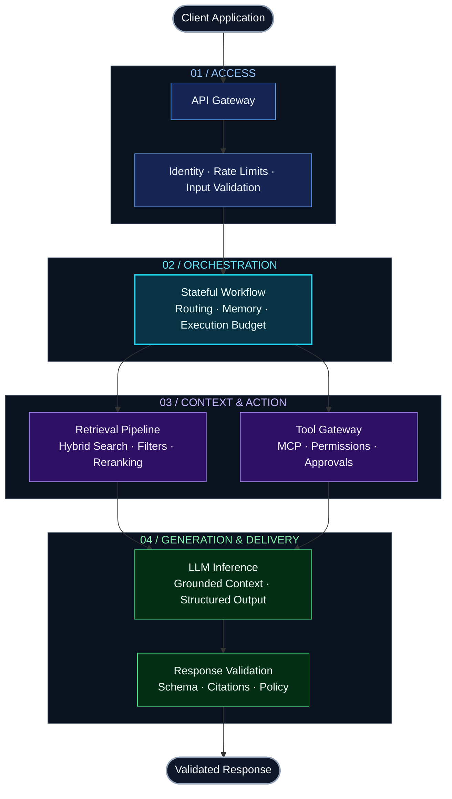

<!--
  GITHUB PROFILE README
  Save as README.md in the SwarnavaDutta/SwarnavaDutta repository.

  Uses GitHub-supported Markdown, HTML tables, and Mermaid.
  Badges and typing animation require external image services.
  Core content remains readable if those services are unavailable.
-->

<!-- HERO HEADER -->

<!-- HERO BANNER -->

 

<b>E N G I N E E R I N G &nbsp; I N T E L L I G E N C E</b>

 

### LEAD AI ENGINEER
**Agentic Systems &nbsp; / &nbsp; Enterprise RAG &nbsp; / &nbsp; Production LLMOps**

 

**From MVP to production**

 
━━━━━━━━━━━━━━━━━━ &nbsp; ✦ &nbsp; ━━━━━━━━━━━━━━━━━━

 
 

&nbsp;

&nbsp;

 
 

━━━━━━━━━━━━━━━━━━ &nbsp; ✦ &nbsp; ━━━━━━━━━━━━━━━━━━

 

I build AI systems that **retrieve with context, act within boundaries,**  
and **deliver outcomes you can evaluate.**
 
 

  <a href="#-the-engineer-behind-the-systems">ABOUT</a>
  &nbsp; / &nbsp;
  <a href="#-where-i-build">FOCUS</a>
  &nbsp; / &nbsp;
  <a href="#-architecture-in-motion">ARCHITECTURE</a>
  &nbsp; / &nbsp;
  <a href="#-the-toolkit">STACK</a>
  &nbsp; / &nbsp;
  <a href="#-lets-build-something-that-matters">CONNECT</a>

 

---

## 🧠 The Engineer Behind the Systems

<table>
<tr>
<td width="60%" valign="top">

### Intelligence meets engineering.

I'm **Swarnava Dutta**, a **Lead AI Engineer** working at the intersection of agentic AI, enterprise knowledge systems, and cloud-native infrastructure.

I design applications that don't just generate answers—they **retrieve the right context, use tools within clear boundaries, and expose the signals needed to evaluate their behavior**.

My approach combines practical model integration with the fundamentals: clean interfaces, explicit state, robust evaluation, and resilient deployment.

**Less unnecessary complexity. More dependable execution.**

</td>
<td width="40%" valign="top">

### ⚡ At a Glance

**BUILD**  
Agents · RAG · AI platforms

**OPERATE**  
Cloud-native services · LLMOps

**OPTIMIZE**  
Quality · Latency · Cost

**PRIORITIZE**  
Clarity · Control · Observability

**CONNECT**  
[https://swarnava.dev](https://swarnava.dev)  
[swarnava.dev@gmail.com](mailto:swarnava.dev@gmail.com)

</td>
</tr>
</table>

 

## 🎯 Where I Build

<table>
<tr>
<td width="33%" valign="top">

### 🤖
### Agentic Systems

**Autonomy, with boundaries.**

Stateful workflows that connect models to tools, memory, and business processes—with explicit execution limits and approval points.

 

`LangGraph` `MCP`  
`Tool Calling` `Checkpoints`

</td>
<td width="33%" valign="top">

### 🔎
### Enterprise RAG

**Context that earns its place.**

Retrieval pipelines that combine hybrid search, access-aware filtering, and reranking to support grounded, relevant answers.

 

`Hybrid Search` `Reranking`  
`Vector Stores` `Citations`

</td>
<td width="33%" valign="top">

### ☁️
### Production LLMOps

**Built to run. Built to inspect.**

Evaluation, tracing, inference optimization, and cloud-native delivery that turn AI capabilities into maintainable services.

 

`LangSmith` `OpenTelemetry`  
`Docker` `AKS`

</td>
</tr>
</table>

 

> **A powerful model is a component. A reliable AI product is an engineered system.**

 

## 🏗️ Architecture in Motion

**One clear request path. Explicit control points. Visibility throughout.**

 

| 🔐 Secure by Design | 📡 Observable by Default | 🧪 Evaluated Continuously |
| :--- | :--- | :--- |
| Identity-aware retrieval | End-to-end request traces | Retrieval and answer quality |
| Least-privilege tool access | Token, latency, and cost tracking | Representative regression cases |
| Scoped memory and retention | Tool outcomes and failure signals | Human-reviewed assessments |

 

## 🛠️ The Toolkit

 

 

| Layer | Technologies & Practices |
| :--- | :--- |
| **🤖 Agentic Orchestration** | `LangGraph` `LangChain` `LlamaIndex` `CrewAI` `MCP` |
| **🧠 Models & Adaptation** | `PyTorch` `Transformers` `PEFT` `LoRA / QLoRA` `Prompt Engineering` |
| **⚡ Inference & Serving** | `Azure OpenAI` `Claude` `vLLM` `Ollama` |
| **🔎 Retrieval & Search** | `Azure AI Search` `Pinecone` `Qdrant` `BM25 + Dense` `Cohere Rerank` |
| **☁️ Cloud & Infrastructure** | `Azure AI Foundry` `AKS` `Docker` `AWS` `Terraform` |
| **📡 Evaluation & Observability** | `LangSmith` `Ragas` `Arize Phoenix` `OpenTelemetry` `Prometheus` `Grafana` |
| **🗄️ Backend & Data** | `FastAPI` `PostgreSQL` `Redis` `Kafka` `PySpark` `Databricks` `Delta Lake` |

<b>🔬 Under the hood — engineering practices</b>

### Agentic Workflows
- Explicit state transitions and checkpointed execution.
- Schema-defined tool interfaces with scoped permissions.
- Timeouts, bounded retries, and execution budgets.
- Human approval for sensitive or high-impact actions.

### Retrieval Pipelines
- Structure-aware chunking and metadata enrichment.
- Dense and sparse retrieval with relevance-based reranking.
- Access-aware context assembly and citation support.
- Separate evaluation of retrieval quality and generation quality.

### Production Operations
- Automated regression checks before deployment.
- Tracing across retrieval, inference, and tool execution.
- Monitoring for latency, token consumption, cost, and failures.
- Containerized services and reproducible infrastructure.

 

## 🧭 The Engineering Standard

<table>
<tr>
<td width="50%" valign="top">

### 01 / Production Is the Product

A demo proves possibility. Production demands concurrency handling, failure recovery, rate-limit awareness, and predictable operational behavior.

</td>
<td width="50%" valign="top">

### 02 / Evidence Before Optimization

Establish quality baselines before tuning prompts, models, or infrastructure. Measure the outcome—not just the sophistication of the implementation.

</td>
</tr>
<tr>
<td width="50%" valign="top">

### 03 / Simplicity Is a Strength

Not every problem needs an agent. Prefer a focused pipeline or deterministic code when it delivers the right result with fewer moving parts.

</td>
<td width="50%" valign="top">

### 04 / Boundaries Build Trust

Authorization, validation, sandboxing, and human oversight belong in the architecture—not in the backlog after launch.

</td>
</tr>
</table>

 

## 📐 Signals That Matter

**What I measure to understand whether an AI system is actually working.**

| | Dimension | Key Signals |
| :---: | :--- | :--- |
| 🎯 | **Answer Quality** | Groundedness · Citation correctness · Task completion |
| 🔎 | **Retrieval Quality** | Context precision · Context recall · Ranking relevance |
| ⚡ | **Performance** | Time to first token · End-to-end latency · Throughput |
| 🛡️ | **Reliability** | Tool success rate · Timeout rate · Recovery behavior |
| 💰 | **Efficiency** | Tokens per task · Cost per successful request · Cache hit rate |
| 🔐 | **Control** | Authorization enforcement · Policy violations · Approval coverage |

 

---

## 🤝 Let's Build Something That Matters

### Your next AI system deserves more than a great demo.

Whether you're designing an enterprise assistant, connecting agents to real workflows,  
or taking an AI platform into production—**let's talk architecture.**

 

<table>
<tr>
<td align="center" width="33%">
  <b>🏢 Enterprise AI</b>
   
  Trusted knowledge. Grounded answers.
</td>
<td align="center" width="33%">
  <b>🤖 Agentic Workflows</b>
   
  Useful tools. Controlled execution.
</td>
<td align="center" width="33%">
  <b>☁️ Production Platforms</b>
   
  Measurable quality. Reliable delivery.
</td>
</tr>
</table>

 

 
 

&nbsp;

&nbsp;

 
 

**[https://swarnava.dev](https://swarnava.dev)**  
[swarnava.dev@gmail.com](mailto:swarnava.dev@gmail.com)

 

---

**Build with intent. Evaluate with evidence. Operate with confidence.**

Swarnava Dutta · Lead AI Engineer

